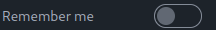
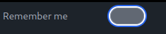
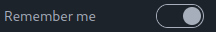

# Reproduction for a daisyUI bug

Repro steps:
1. Clone the repo (obv)
2 npm install
3. npm run dev
4. open localhost:5173 in the browser
5. The checkbox renders as expected

6. click the checkbox. It turns gray instead of toggling as expected:

7. Click elsewhere to remove focus, the checkbox goes back to rendering as expected

Tested in `firefox 133.0.3` and `chrome 131.0.6778.204`
